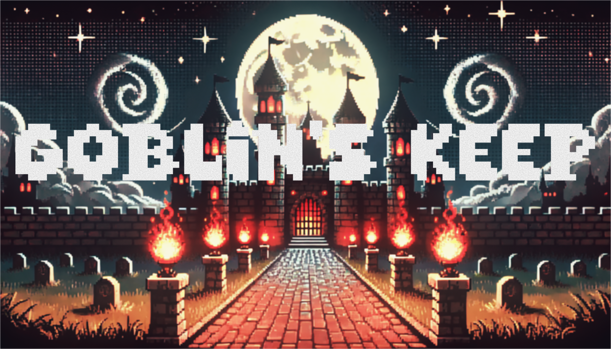

# Goblin's Keep



## About the Game

**Goblin's Keep** is a 2D tile-based escape game where the player navigates a maze-like castle while avoiding goblins and traps, collects 5 keys to activate a lever, and walks through the unlocked exit door to escape.

This repository now hosts the **TypeScript / browser port** of the original Java Swing project. The web build lives under `web/` and runs entirely in the browser.

## Key Features

- **AI movement** — goblins use A* pathfinding when the player enters their line of sight, and wander randomly otherwise.
- **Scoring** — keys, score-multiplier bonuses (meat), and trap penalties feed a final score breakdown shown on the end screen.
- **State machine** — `MENU` / `INSTRUCTIONS` / `PLAYING` / `PAUSED` / `END`, with cursor-driven menus and looping background music.
- **Pixel-art presentation** — fixed-step 60 Hz game loop on a 768×576 canvas, rendered through a Pokémon-style centered camera.
- **Keyboard-only controls** — touch devices get a "mobile version coming soon" notice.

## Controls

| Action | Keys |
| --- | --- |
| Move | WASD or Arrow Keys |
| Pause / resume | P or Esc |
| Toggle music | M |
| Menu navigation | Up / Down (or W / S), Enter / Space to select |

## Stack

- **Build / language** — Vite 8, TypeScript 6 (strict), pnpm 10
- **Rendering** — HTML5 Canvas 2D with `image-rendering: pixelated`
- **Audio** — Web Audio API
- **Tests** — Vitest 4
- **CI** — GitHub Actions (`.github/workflows/web.yml`)

## Build and Play

From the `web/` directory:

```bash
pnpm install
pnpm dev      # starts the Vite dev server
pnpm build    # type-check + production build into web/dist
pnpm preview  # serves the production build locally
```

## Test

From the `web/` directory:

```bash
pnpm test     # runs the Vitest suite (vitest run)
```

## Authors

Originally developed for CMPT 276 by:

- Maxime Nereyabagabo
- Hugo Najafi
- Arun Paudel
- Srinivas Suggu

TypeScript / browser refactor: Maxime Nereyabagabo.

## Acknowledgements

- [Dr. Saba Alimadadi](http://www.sfu.ca/~saba/) — for teaching the software-development principles the original project was built on.
- [RyiSnow](https://www.youtube.com/@RyiSnow) — for the Java game-development tutorials that informed the original architecture.
